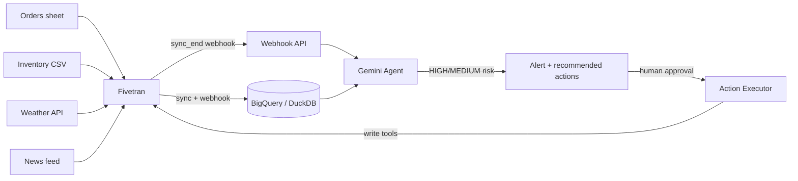

# Supply Chain Pulse

AI agent that monitors supply chain risk in real time — powered by Gemini and the Fivetran MCP server.

## The problem

$1.5 trillion is lost globally every year to supply chain disruptions (McKinsey, 2023).
Mid-market manufacturers — 400M+ businesses worldwide — have no early-warning system
because their data lives in silos: spreadsheets, ERPs, logistics portals, and external
APIs that never talk to each other. Supply Chain Pulse unifies these sources via
Fivetran, watches them continuously, and recommends action before disruptions hit.

## How it works



1. **Sync** — Four sources (orders, inventory, weather, news) flow into the analytics
   warehouse via Fivetran connections.
2. **Trigger** — A Fivetran webhook fires on every completed sync; no polling.
3. **Analyze** — The agent gathers multi-source signals from analytic views and asks
   Gemini to synthesize them into a structured risk report.
4. **Alert** — HIGH/MEDIUM risk reports become alerts with prioritized, costed
   recommendations.
5. **Act (with approval)** — A human approves an action; only then does the agent
   call Fivetran MCP write tools to reconfigure the pipeline.

## Fivetran MCP tools used

| Tool | Type | Purpose |
|---|---|---|
| `list_connections` | read | Audit all active data sources |
| `get_connection_details` | read | Per-connection sync status, last sync, row counts |
| `get_connection_state` | read | Detect stuck or failed syncs |
| `get_connection_schema_config` | read | Understand table structures for pipeline health |
| `list_transformation_projects` | read | Check dbt transformation status |
| `sync_connection` | write | Force a fresh sync (manual or emergency) |
| `modify_connection` | write | Raise sync frequency when risk is elevated |
| `create_connection` | write | Add a backup-supplier data source on approval |
| `create_account_webhook` | write | Register the sync-completion trigger |
| `run_transformation` | write | Refresh aggregated analytics tables |

### Mock vs. real MCP backend

`fivetran_mcp/client.py` is a thin client that can run against two backends,
selected by the `USE_MOCK_MCP` env var:

- **`USE_MOCK_MCP=true` (default)** — routes every call through an in-process
  mock backend driven by JSON fixtures in `data/`. This is what the demo runs
  on: it's deterministic, requires no live credentials, and reproduces the
  "perfect storm" scenario exactly every time.
- **`USE_MOCK_MCP=false`** — intended to route through a real `fivetran-mcp`
  server via the `mcp` SDK. That server isn't part of this repo and has no
  documented connection endpoint yet, so this path currently raises
  `NotImplementedError` with a message pointing back at the mock flag. Wiring
  up a real MCP server is future work, not required for the demo — the agent
  code is already written to call the client identically either way, so only
  this module would need to change.

## Quick start (< 10 minutes)

```bash
git clone <repo-url> && cd supply-chain-pulse
python -m venv .venv && source .venv/bin/activate
pip install -r requirements.txt
cp .env.example .env   # fill in GEMINI_API_KEY at minimum; USE_MOCK_MCP=true needs nothing else
python -m data.generate_mock_data
python -m data.seed_db
./run_demo.sh          # starts the API on :8000 and the UI on :8501
```

Open `http://localhost:8501`.

## Running the demo scenario

```bash
python -m demo.scenario   # resets to the "perfect storm" state in under 30 seconds
./run_demo.sh             # or, if already running, just trigger the webhook below
```

Trigger the webhook (or click "Sync now" on the orders connection in the Pipeline tab):

```bash
curl -X POST http://localhost:8000/webhook/fivetran \
  -H "X-Fivetran-Signature: <hmac-sha256 of body using WEBHOOK_SECRET>" \
  -d '{"event": "sync_end", "data": {"connection_id": "conn_orders_001", "status": "successful", "sync_id": "demo_sync"}}'
```

Every Fivetran MCP call — mock or real — is appended to `logs/tool_calls.jsonl`,
visible live during the demo.

## Running tests

```bash
pytest -v
```

## License

MIT — see `LICENSE`.
